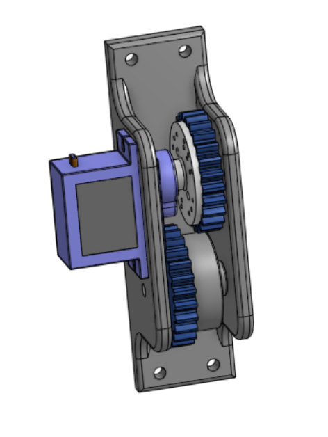
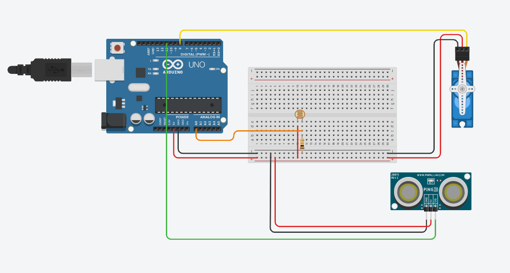

# Motion Sensored Jack in the Box (Dom and Zac)

## Table of Contents 
* [Planning Stage](#planning-stage) 
* [CAD Renderings](#cad-renderings)
* [Base Construction](#base-construction)
* [Gear Construction](#gear-construction) 
* [Arduino Code](#arduino-code)
___

### Planning Stage
#### Purpose & Expectations
> To work diligently in order to create a product that improves and expands our overall knowledge of how basic engineering operates.  We are expected to work professionally, using our time and resources wisely.  We are expected to work with our partners efficiently to create an object that operates under the parameters provided. WIth this we will create device that incorporates all of the aspects of enginering we have learned about to scare and startle those who aren’t scared and startled enough in an effort to make the world a less scared-and-startle-free space.

#### Description (establishing the foundation)
> While planning, we knew that we wanted a device that would fit all of the perameters and requirments, while still being creative by adding ourown twist to the project.  This is where the "JacK in the Box" idea (credited to Zac) came in.  So at this point we had established a vison, howver we needed to exeute this.  After many plans and ideas we decided that a servo motor would be the most efficent and eiscreate way to turn the gears, creating the sound and giving that unnoticable and unsettling effect. This would be facilitated through a gear to the interior, and this servo would be inititaed by the ullrasonic sensor detecting movement.  Howver at this point we needed a way to stop the device at the correct time, so we plan to use a photorestir to stop the box by detecting light with its opening.  So now we have a plan, and only have to make it happen. 

#### Planning Document
[Here is the planning doc that was created pre-creation](https://docs.google.com/document/d/1VZ0yBxpb9KwrkzfvlptIvGs4Mx1cKSWb2F__tJyYy9g/edit#)

#### Initital Sketch (Ended up being VERY close to final)


#### Reflection
> This was pretty straight forward but again some major takaways for the future...
> - When inserting base, set about the origine so you have one defined part.
> - When inserting things such as screws or nuts, do not do it one by one, pick all spots and insert all once.
> - Make sure that mates such as ones for wheels are resolute so they can turn.
>
> Skateboard complete!
### Materials Used

- Acrylic (base of box)
- 3d printer (gears)
- Axel Hub (for shaft attachment)
- Wires 
- Ultrasonic Sensor (imput for when to start servo)
- Photoresistor (signals servo to stop)
- Servo (to turns drum which makes music and opens box)
- Resistors
- Wires
- Arduino
- Battery pack
- Screws

### Milestones
___

## CAD Renderings 
### Base Construction
#### Description
> In order to fit all of the necessary aspects incorporated with the Box such as the wires, battery mount (power supply), arduino and breadboard, and photoresistor, we needed an area to store all of this.  This is where the base came in, as we decided that with a base we would be able to fit all of the necessary components while still having a singular box, as the jack and the base would attach to each other.  We did this using a friction fit style, creating a 5 side box with an open top, using 3mm acrylic to reserve material and resources.  Next, in order to make the box stay on the box we had to make a shelf, aligned across the inside of each wall that the Jack in the Box could sit on.  Then, we extruded and cut as necessary in order to provide holes for screws, switches, ect.  Finally, we needed a top to this box that was removable for adjustments but sturdy to provide something for the springs to push against; we did this also using acrylic, and we provided open spaces for the photoresistor and breadboard as necessary, while designing it so that it would fit snug across to shelf designed on the walls of the base.
#### Evidence
[Base in OnShape](https://cvilleschools.onshape.com/documents/0683eb52a22173b51047934c/w/f86c45cb89f616eb262b8ff8/e/189681eae29da1fce519768c)
#### Image


#### Reflection
> All in all the contruction and printing istelf was reletively easy despite a few hicups, howver after going through it, here are a few take ways from my experience creating this...
- When possible, always try to use accrilic and laser cut. We had orriginally planned to 3D print the entire this, howver we that would have cost almost 10 times the amount of, which was esspecial helpful considering the fact that we had to reprint.
- Friction fit is an extermely efficient and easy way to attach things such as a box together.
- Always leave yourself more room than anticpated. This came up as we had orriginaly not left oursleves enough space to make the actually Jack attatch to the base, however we were able to fix this through extruding the walls 3mm's up and than reprinting.
- Mentaly walk through the design and the CONSTRUCTION OF THE OTHER PIECES TO THE BOX! I say this because we had trouble attching the differnet aspects because they seemed to fit on OnShape howver when doing it by hand it was much more difficult, so just double check.
All in all it was a fun build and I am super happy with the way it came out.
___

### Gear Construction
#### Description
> To run our Jack in the Box on a servo we had to attach our servo to a shaft that connected to the drum which made the musid and opened the box. To achive this we created a gearbox with two 3d printed gears. One of the gears was screwed onto a metal axel hub. The axel hub had a hole in it that the shaft  of the jack in the box would go through. However the shaft and hole of the axel hub had different diameters, so we needed to print a smaller piece that could copensate for the differnce in diamters. The second gear was screwed onto a servo head. To get the gears onto the shaft we had to remove the shaft from the box and then put the gears on. We then used a bracket to hold the gears in the correct position so that when the servo spinned, the shaft also spinned creationg music and trigering the opening mechanism for the box. 
#### Evidence
[Gearbox in OnShape](https://cvilleschools.onshape.com/documents/423806bfa6dff149a997954e/w/4dd89bd35a6ce4db869d6986/e/77e276e17288adce5d357a35)
#### Image


Gear Box Assembly
#### Reflection
> Througout the process of designing the gear box we ran into several challenges.
- When making holes often times because they were so small they cave in on themselves, so sometimes we had to manually enlarge them with a drill. In the future we could make the holes slightly larger than needed in the attempt that is they cave in they will still be the right size.
___

## Arduino Code
#### Description
#### Evidence

```
#include <Servo.h>
Servo myservo;
const int trigPin = 9;
const int echoPin = 10;
float duration, distance;
int light = 0; // store the current "light" value

void setup() {
  pinMode(trigPin, OUTPUT);
  pinMode(echoPin, INPUT);
  Serial.begin(9600);
  myservo.attach(11); //attaches the servo on pin 11
  pinMode(8, OUTPUT);
}

void loop() {
  light = analogRead(A0);// Reads "light" level from photoresistor and prints it.
  Serial.println(light);
  digitalWrite(trigPin, LOW);
  delayMicroseconds(2);
  digitalWrite(trigPin, HIGH);
  delayMicroseconds(10);
  digitalWrite(trigPin, LOW);
  duration = pulseIn(echoPin, HIGH);
  distance = (duration * .0343) / 2; //Calculates distance from hand to sensor
  Serial.print("Distance: "); // prints the distance
  Serial.println(distance);
  delay(100);
  if (distance < 15) { // If hand is close to sensor rotate servo
    myservo.write(155); 
  } 
  if (light > 200) {
    Serial.println("Light");//If the "light" level is greater then 600 turn the "light" off and print "light".
    digitalWrite(8, LOW);
  
    myservo.write(90); //Turns of servo
  }
}

```

#### Image

Wiring Diagram

#### Reflection

___
